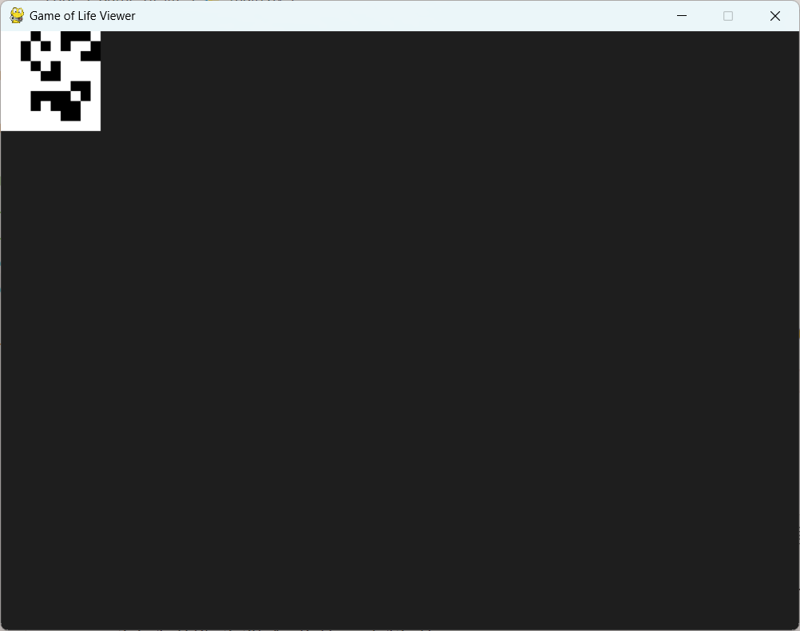

# Conway's Game Of Life in Python


*This is how the terminal view looks without the GUI.*

A simple implementation of GOL in Python with in terminal view and window interface using pygame.

## Dependencies
- Python 3.x
- Pygame 2.6.x

## Dependencies
- Python 3.x
- Pygame 2.6.x

Install dependencies with:
```sh
pip install pygame
```

## How to run ?
Clone the repo :
```sh
$git clone https://github.com/ArcadeCode/game-of-life.git
$cd ./game-of-life/
```
Run with python `src/main.py`
```sh
python ./src/main.py --size 10 --iteration 10 --seed 5 --activateGui True
```

*This is the GUI version of the simulation using Pygame.*

You can change values, if you want to generate a random seed, simply omit the ``--seed`` parameter.

## Changelog:
- **v1.1**
    - Added GUI with pygame
    - Added zoom and pan functionality in the simulation
    - Added `--usingGui` parameter to toggle the GUI interface
- **v1.0**
    - Initial release
    - Added parameters like `--seed` to manipulate the seed of the initial generation.